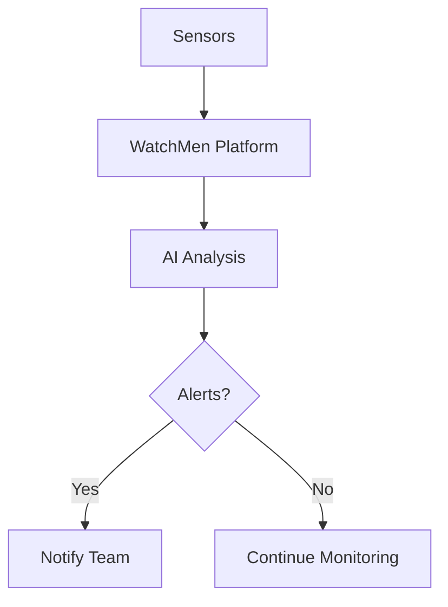

## Überblick

Die Novo AI WatchMen Platform ermöglicht es Ihnen, industrielle Maschinen in Echtzeit zu überwachen, Ausfälle vorherzusagen, bevor sie auftreten, und Ihre Abläufe mit fortschrittlicher KI zu optimieren. Sie erhalten umsetzbare Erkenntnisse über intuitive Dashboards, automatisierte Warnmeldungen und anpassbare Workflows. Diese Kernfunktionen helfen, Ausfallzeiten zu reduzieren, Wartungskosten zu senken und die Produktivität in Branchen wie Fertigung, Energie und Logistik zu steigern.

<Callout kind="info">
WatchMen integriert sich nahtlos mit IoT-Sensoren und bestehenden PLC-Systemen. Beginnen Sie, indem Sie Ihre Geräte über das Dashboard unter `https://dashboard.example.com` verbinden.
</Callout>

## Zentrale Funktionen

Lernen Sie die wichtigsten Möglichkeiten der Plattform über diese Funktionskarten kennen.

<Columns cols={3}>
  <Card title="Echtzeitüberwachung" icon="activity" href="#real-time-monitoring">
    Verfolgen Sie Maschinenzustandsdaten wie Vibration, Temperatur und Drehzahl (RPM) in Echtzeit.
  </Card>
  <Card title="Vorausschauende Wartung" icon="trending-up" href="#predictive-maintenance">
    KI-Modelle sagen Ausfälle mit 95% Genauigkeit anhand historischer Daten voraus.
  </Card>
  <Card title="Datenanalyse" icon="bar-chart-3" href="#data-analytics">
    Erstellen Sie individuelle Berichte und visualisieren Sie Trends für bessere Entscheidungen.
  </Card>
  <Card title="Individuelle Workflows" icon="settings" href="#custom-workflows">
    Bauen Sie maßgeschneiderte Automatisierungsregeln ohne Programmierkenntnisse.
  </Card>
</Columns>

## Echtzeit-Maschinenüberwachung

Richten Sie eine kontinuierliche Überwachung ein, um sofortige Warnmeldungen bei Anomalien zu erhalten.

<Steps>
  <Step title="Geräte verbinden" icon="link">
    Fügen Sie Ihre IoT-Sensoren im Dashboard hinzu.

````javascript
// Example API call to register a device
const response = await fetch('https://api.example.com/v1/devices', {
  method: 'POST',
  headers: { 'Authorization': `Bearer ${YOUR_API_KEY}` },
  body: JSON.stringify({
    name: 'Machine-001',
    type: 'vibration-sensor',
    location: 'Factory-Line-A'
  })
});
````

  </Step>
  <Step title="Warnmeldungen konfigurieren" icon="bell">
    Definieren Sie Schwellenwerte für wichtige Kennzahlen.
  </Step>
  <Step title="Dashboard anzeigen" icon="monitor">
    Greifen Sie auf Live-Datenströme zu.
  </Step>
</Steps>

Warnmeldungen informieren Sie per E-Mail, SMS oder Webhooks, wenn Kennzahlen Grenzwerte überschreiten, zum Beispiel Temperatur `{>80°C}`.

## Vorausschauende Wartung

Nutzen Sie KI-Modelle, die auf Ihren Daten trainiert sind, um Probleme proaktiv vorherzusagen.

<Tabs>
  <Tab title="Vibrationsanalyse" icon="activity">
    Erkennt Unwuchten frühzeitig.

````python
import requests

payload = {
    "model": "vibration-predictor",
    "data": [120.5, 115.2, 130.1]  # Recent vibration readings
}
response = requests.post('https://api.example.com/v1/predict', json=payload)
print(response.json()['failure_probability'])  # e.g., 0.12
````
  </Tab>
  <Tab title="Temperaturprognose" icon="thermometer-sun">
    Sagt Überhitzungstendenzen voraus.

````javascript
// JavaScript example
const data = { readings: [75, 78, 82, 85] };
const prediction = await fetch('https://api.example.com/v1/predict/temperature', {
  method: 'POST',
  body: JSON.stringify(data)
});
````
  </Tab>
</Tabs>

<Callout kind="tip">
Planen Sie ein tägliches Retraining der Modelle ein, um die Genauigkeit zu maximieren.
</Callout>

## Datenanalyse und Reporting

Analysieren Sie die Performance mit den integrierten Tools.

| Kennzahl       | Beschreibung                          | Beispielschwelle |
|----------------|---------------------------------------|------------------|
| Uptime         | Prozentsatz der Betriebszeit          | `{>99%}`         |
| MTBF           | Mittlere Zeit zwischen Ausfällen      | `{>500 hours}`   |
| Energieverbrauch | kWh pro Maschinenstunde             | `<10 kWh`        |

Exportieren Sie Berichte im PDF- oder CSV-Format.

## Anpassbare Optimierungs-Workflows

<Expandable title="Erweitertes Workflow-Beispiel" default-open="false">

Erstellen Sie Regeln wie `Wenn Vibration {>threshold}, Maschine anhalten und Team benachrichtigen`.

````yaml
# Workflow configuration
workflow:
  name: "High-Vibration Alert"
  trigger:
    metric: vibration
    operator: ">"
    value: 120
  actions:
    - type: "pause_machine"
    - type: "send_webhook"
      url: "https://your-webhook-url.com/webhook"
````

</Expandable>

## Branchenanwendungen

<Columns cols={2}>
  <Card title="Fertigung" icon="factory">
    Reduzieren Sie Ausfallzeiten um 30% durch Vibrationsüberwachung an Fertigungslinien.
  </Card>
  <Card title="Energiesektor" icon="zap">
    Sagen Sie Turbinenausfälle anhand von Temperatur- und Lastdaten voraus.
  </Card>
  <Card title="Logistik" icon="truck">
    Überwachen Sie Flottenfahrzeuge für vorausschauende Wartung der Bremsen.
  </Card>
</Columns>



Bereit für die Umsetzung? Im [Quickstart](/de/quickstart) finden Sie eine Schritt-für-Schritt-Anleitung für die Einrichtung.