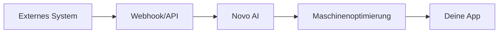

## Übersicht

Novo AI unterstützt Integrationen mit externen Systemen, um deine Maschinenoptimierungsprozesse zu vereinfachen. Nutze die REST-API für programmatischen Zugriff, Webhooks für Echtzeit-Benachrichtigungen und vorkonfigurierte Konnektoren für gängige Tools. So automatisierst du Abläufe über IoT-Sensoren, ERP-Systeme und individuelle Anwendungen hinweg.

<Callout kind="info">
Bevor du integrierst, generiere einen API-Schlüssel in deinem Dashboard unter `https://dashboard.example.com/settings/api`.
</Callout>

## API-Verbindungen

Richte API-Verbindungen ein, um Maschinendaten abzurufen oder Optimierungen programmatisch auszulösen.

### Authentifizierung

Alle API-Anfragen erfordern ein Bearer-Token. Verwende den `{API_KEY}`, den du aus deinem Dashboard erhältst.

<ParamField header="Authorization" param-type="string" required="true">
  Bearer `{YOUR_API_KEY}`
</ParamField>

<ParamField query="machine_id" param-type="string" required="false">
  Filtere nach einer bestimmten Maschinen-ID.
</ParamField>

### Maschinenstatus abrufen

Rufe den Echtzeitstatus deiner Maschinen ab.

<Request tabs="JavaScript,cURL" show-lines="true">
  ```javascript
  const response = await fetch('https://api.example.com/v1/machines', {
    headers: {
      'Authorization': 'Bearer YOUR_API_KEY'
    }
  });
  const data = await response.json();
  console.log(data);
  ```
  ```bash
  curl -X GET 'https://api.example.com/v1/machines' \
    -H 'Authorization: Bearer YOUR_API_KEY'
  ```
</Request>

<Response tabs="200">
  ```json
  {
    "machines": [
      {
        "id": "mach_123",
        "status": "optimized",
        "performance": 98.5
      }
    ]
  }
  ```
</Response>

## Webhook-Konfiguration

Webhooks benachrichtigen deinen Endpunkt über Ereignisse wie Maschinenwarnungen oder abgeschlossene Optimierungen.

### Einrichtungsschritte

<Steps>
  <Step title="Webhook erstellen" icon="settings">
    Navigiere zu `https://dashboard.example.com/webhooks/new` und gib deine Endpoint-URL ein, zum Beispiel `https://your-webhook-url.com/novo-ai`.
  </Step>
  <Step title="Ereignisse auswählen" icon="zap">
    Wähle Ereignisse aus: `machine.optimized`, `alert.triggered`.
  </Step>
  <Step title="Endpoint verifizieren" icon="check-circle">
    Novo AI sendet einen Challenge-Ping. Antworte mit `200 OK`.
  </Step>
</Steps>

### Eingehende Webhooks verarbeiten

Nutze dieses Beispiel, um Payloads sicher zu verarbeiten.

<CodeGroup tabs="Node.js,Python">
  ```javascript
  const express = require('express');
  const app = express();
  app.use(express.json());

  app.post('/novo-ai', (req, res) => {
    const event = req.headers['x-novo-event'];
    const payload = req.body;
    
    if (event === 'machine.optimized') {
      console.log('Machine optimized:', payload.machine_id);
    }
    
    res.status(200).send('OK');
  });

  app.listen(3000);
  ```
  ```python
  from flask import Flask, request, jsonify

  app = Flask(__name__)

  @app.route('/novo-ai', methods=['POST'])
  def webhook():
      event = request.headers.get('X-Novo-Event')
      payload = request.json
      
      if event == 'machine.optimized':
          print(f'Machine optimized: {payload["machine_id"]}')
      
      return jsonify({'status': 'OK'}), 200

  if __name__ == '__main__':
      app.run(port=3000)
  ```
</CodeGroup>

## Beliebte Integrationen

Verbinde gängige Tools per API oder über Zapier/Make.com.

<Columns cols={3}>
  <Card title="ERP-Systeme" icon="database" href="https://dashboard.example.com/integrations/erp">
    Synchronisiere Bestands- und Produktionsdaten mit SAP oder Oracle.
  </Card>
  <Card title="IoT-Geräte" icon="zap" href="https://dashboard.example.com/integrations/iot">
    Ziehe Sensordaten aus AWS IoT oder Azure IoT Hub.
  </Card>
  <Card title="Monitoring-Tools" icon="activity" href="https://dashboard.example.com/integrations/monitoring">
    Leite Warnmeldungen an Datadog oder New Relic weiter.
  </Card>
</Columns>

## IoT- und Sensorintegration

Für IoT-Geräte verwende die Machines-API, um Sensoren zu registrieren.

<Tabs>
  <Tab title="MQTT" icon="wifi">
    Veröffentliche Sensordaten an `mqtt.example.com/novo/sensors/{machine_id}`.
    
    ```bash
    mosquitto_pub -h mqtt.example.com -t novo/sensors/mach_123 \
      -m '{"temperature": 75.2, "vibration": 0.5}'
    ```
  </Tab>
  <Tab title="HTTP Push" icon="upload">
    Sende eine POST-Anfrage direkt an den Ingestion-Endpoint.
    
    <Request show-lines="false">
      ```bash
      curl -X POST 'https://api.example.com/v1/sensors/ingest' \
        -H 'Authorization: Bearer YOUR_API_KEY' \
        -d '{"machine_id": "mach_123", "temperature": 75.2}'
      ```
    </Request>
  </Tab>
</Tabs>

## Best Practices

<Expandable title="Sichere Integrationen" default-open="true">
  - Rotiere API-Schlüssel monatlich.
  - Verwende HTTPS für alle Endpoints.
  - Validiere Webhook-Signaturen mit HMAC SHA-256.
  - Begrenze Webhook-Retries auf 5 Versuche.
</Expandable>

<Callout kind="tip">
Überwache Integrationslogs unter `https://dashboard.example.com/logs`, um Probleme schnell zu debuggen.
</Callout>



Integriere selbstbewusst, um deine Workflows deutlich zu verbessern. Für individuelle Anforderungen kontaktiere den Support über das Dashboard.