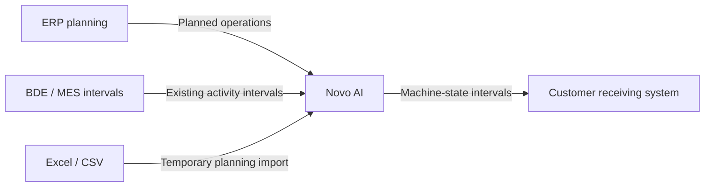

## Introduction

This guide explains what your organization should provide so Novo AI can integrate with your existing production systems. It is vendor-neutral and applies to ERP, MES, BDE/shop-floor data collection, database, API, and file-based environments.

A successful integration requires more than field names. Before implementation, identify the authoritative source systems, confirm stable identifiers, define units and timestamp rules, provide representative sample data, and agree how Novo AI will access or exchange the data.

<Callout kind="info" collapsed="false">
  **Minimum preparation package:** provide a representative sample export or interface schema, field descriptions and units, machine/resource identifiers, plant timezone, production-time semantics, access/interface details, and technical plus operational contacts for validation.
</Callout>

### Supported integration paths



| Integration path                | Direction                  | Record granularity                    | Customer provides                                  | Typical access                          |
| ------------------------------- | -------------------------- | ------------------------------------- | -------------------------------------------------- | --------------------------------------- |
| **Direct ERP planning import**  | ERP -> Novo AI             | One planned operation per record      | Planning/order fields and stable resource mapping  | Read-only source access                 |
| **Machine & production export** | Novo AI -> customer system | One continuous machine-state interval | Writable target and accepted state/duration fields | Read/write or equivalent API operations |
| **Existing BDE/MES import**     | BDE/MES -> Novo AI         | One recorded activity/state interval  | Interval, machine, state, and order identifiers    | Read-only source typically sufficient   |
| **Temporary Excel/CSV import**  | File -> Novo AI            | One planned operation per row         | Upload template with agreed formats and units      | No live system connection required      |

### Customer-side readiness checklist

- Identify the ERP planning source and the table, view, API, or export containing planned production operations.
- Identify the machine/resource master and confirm the stable machine/resource code used across systems.
- Confirm the production-site timezone and daylight-saving-time behavior.
- Confirm quantity units such as `pcs`, `kg`, or `m`, and the time units used by the source system.
- Confirm whether planned production time applies **per unit** or to the **complete order quantity**.
- Provide representative test data containing multiple orders, operations, machines, and edge cases.
- If existing BDE/MES intervals are in scope, provide the state/activity model and order/resource references.
- If Novo AI data will be written back, provide the target interface/table and required authentication/network access.
- Provide technical and production-planning contacts who can validate mappings and test results.

## General data requirements

These principles apply regardless of whether data comes from an ERP, MES/BDE system, database interface, API, or spreadsheet. Most integration issues originate from ambiguous identifiers, inconsistent units, or timestamp interpretation rather than from the transport technology itself.

### Stable identifiers

Identifiers used for matching must remain stable over time. Display names may change; matching keys should not. Treat identifiers as strings even when they contain digits only because leading zeros, prefixes, suffixes, and revisions may be meaningful.

| Concept               | Recommended type | Good example          | Why it matters                                       |
| --------------------- | ---------------- | --------------------- | ---------------------------------------------------- |
| Production order ID   | String           | `PO-2026-004582`      | Stable key for the production order                  |
| Material/product ID   | String           | `MAT-0004711`         | Preserves ERP material-number formatting             |
| Machine/resource code | String           | `MILL-12`             | Stable machine mapping independent of display name   |
| Operation sequence    | String           | `A10`                 | Supports `10`, `0010`, `A10`, and similar ERP values |
| Interval ID           | String           | `BDE-20260729-000123` | Stable identity for source intervals                 |

<Callout kind="alert" collapsed="false">
  **Preserve identifiers exactly.** Do not strip leading zeros, translate identifiers, change capitalization, or recreate IDs from human-readable names. For example, resource code `00012` must not silently become `12`.
</Callout>

### Accepted logical data types

| Type           | Meaning                               | Example                           | Guidance                                            |
| -------------- | ------------------------------------- | --------------------------------- | --------------------------------------------------- |
| `String`       | Text or identifier                    | `0004711`, `MACHINE-12`, `A10`    | Preferred for identifiers; preserves formatting     |
| `Integer`      | Whole number                          | `900`                             | Used for complete seconds and whole-number counters |
| `Decimal`      | Numeric value with optional fraction  | `125.5`, `0.85`                   | Used for quantities, energy, weight, length         |
| `Timestamp`    | Date and time representing an instant | `2026-07-29T08:00:00+02:00`       | Timezone-aware ISO 8601 preferred                   |
| `Date`         | Calendar date                         | `2026-07-29`                      | Use `YYYY-MM-DD`                                    |
| `Time`         | Local clock time                      | `08:30:00`                        | Use `HH:mm:ss`; site timezone is still required     |
| `String[]`     | Zero or more text values              | `urgent, export`                  | A spreadsheet may store the list in one cell        |
| `Object / Map` | Flexible key-value attributes         | `{"production_family":"housing"}` | Use only for agreed additional attributes           |

### Timestamp and timezone rules

For automated interfaces, timezone-aware timestamps are strongly preferred.

```text
Preferred: 2026-07-29T08:00:00+02:00
UTC form:  2026-07-29T06:00:00Z
Avoid:     07/29/26 08:00
```

If the source provides only local date/time values, the production-site timezone must be explicitly agreed during setup.

<Callout kind="alert" collapsed="false">
  **Daylight-saving-time caution:** never infer timestamps from the browser, laptop, or server timezone. Local times can be ambiguous around daylight-saving-time changes; the plant/site timezone must be known.
</Callout>

### Quantities, units, and durations

- Every planned quantity must have a unit, for example `planned_quantity = 250` with `quantity_unit = pcs`.
- Canonical duration fields ending in `_seconds` use non-negative integer seconds. For example, `900` means 15 minutes.
- Do not send `00:15:00` into a field documented as integer seconds unless the interface explicitly defines a duration-string format.
- For machine-readable CSV, use a dot as the decimal separator unless another file format is explicitly agreed.
- Do not assume arbitrary unit conversion. Source units and required normalization must be agreed during mapping.

### Empty value vs. zero

A blank or `null` value and `0` have different meanings:

- **Blank / null:** the source did not provide the value.
- **0:** the value is known and is actually zero.

Do not automatically replace unknown optional numeric values with zero. The machine-state export is a deliberate exception: non-applicable state-duration columns are intentionally set to `0` for each interval.

### Recommended file hygiene

For temporary Excel/CSV imports:

- Use one header row and one planned operation per data row.
- Avoid merged cells, hidden semantic information in formatting, and formulas that depend on external workbooks.
- For CSV, agree the delimiter and encoding; UTF-8 is recommended for international text.
- Keep identifier columns as text to preserve leading zeros.
- Use one consistent timestamp representation per import.

## Direct ERP integration

For a direct ERP integration, Novo AI reads planned production and order information from the customer system. One record represents one planned operation or production step assigned to a machine/resource. **Read-only access to the planning source is sufficient.**

<Callout kind="info" collapsed="false">
  **Record granularity:** one record = one planned operation on one resource. If an order contains Cutting, Drilling, and Inspection, these should normally appear as three operation records with their own sequence, times, and resource assignment.
</Callout>

### Required ERP -> Novo AI planning fields

| Field                              | Type      | Example                     | Requirement / notes                                                                                                        |
| ---------------------------------- | --------- | --------------------------- | -------------------------------------------------------------------------------------------------------------------------- |
| `order_id`                         | String    | `PO-2026-004582`            | Unique, permanently stable production-order identifier. May also serve as display name when no separate order name exists. |
| `customer_code`                    | String    | `CUST-0042`                 | Stable customer identifier.                                                                                                |
| `customer_name`                    | String    | `Meyer Automotive GmbH`     | Human-readable customer name.                                                                                              |
| `order_tags`                       | String\[] | `urgent, export`            | Labels used to identify, group, or filter orders.                                                                          |
| `product_id`                       | String    | `MAT-0004711`               | Stable product/material identifier; preserve leading zeros and prefixes.                                                   |
| `planned_quantity`                 | Decimal   | `250`                       | Quantity planned for this order/operation; must not be negative.                                                           |
| `quantity_unit`                    | String    | `pcs`                       | Unit belonging to `planned_quantity`, for example `pcs`, `kg`, `m`.                                                        |
| `planned_start`                    | Timestamp | `2026-07-29T08:00:00+02:00` | Planned operation start; timezone-aware value preferred.                                                                   |
| `planned_end`                      | Timestamp | `2026-07-29T10:30:00+02:00` | Planned operation end; should be later than `planned_start`.                                                               |
| `operation_sequence`               | String    | `A10`                       | Operation/routing sequence. Keep as text to support `10`, `0010`, `A10`, etc.                                              |
| `operation_description`            | String    | `CNC milling housing`       | Human-readable description of the production step.                                                                         |
| `planned_preparation_time_seconds` | Integer   | `900`                       | Planned setup/preparation duration in seconds.                                                                             |
| `planned_production_time_seconds`  | Integer   | `7200`                      | Planned production duration in seconds; production-time basis must be agreed.                                              |
| `resource_code`                    | String    | `MILL-12`                   | Stable ERP machine/resource identifier used to match the corresponding Novo AI resource.                                   |
| `resource_name`                    | String    | `5-Axis Milling Machine 12` | Human-readable machine/resource name for display and validation.                                                           |

<Callout kind="success" collapsed="false">
  **Uniqueness rule:** `order_id + operation_sequence + resource_code` should uniquely identify one planned operation unless another agreed stable operation identifier is provided.
</Callout>

### Production-time semantics

`planned_production_time_seconds` is only meaningful when both systems agree whether it represents the complete order quantity or one individual unit.

<Tabs>
  <Tab title="Total order">
    | Field                             | Example       |
    | --------------------------------- | ------------- |
    | `planned_quantity`                | `100`         |
    | `planned_production_time_seconds` | `7200`        |
    | `planned_production_time_basis`   | `TOTAL_ORDER` |

    All 100 units are planned to require 7,200 seconds in total.
  </Tab>

  <Tab title="Per unit">
    | Field                             | Example    |
    | --------------------------------- | ---------- |
    | `planned_quantity`                | `100`      |
    | `planned_production_time_seconds` | `72`       |
    | `planned_production_time_basis`   | `PER_UNIT` |

    Each unit is planned to require 72 seconds. Total planned processing can be derived separately where appropriate.
  </Tab>
</Tabs>

Where the source ERP can provide it, `planned_production_time_basis` is strongly recommended with values such as `TOTAL_ORDER` or `PER_UNIT`. It remains an extension field unless specifically configured as mandatory.

### Optional planning fields

| Field                   | Type         | Example                               | Requirement / notes                                                                        |
| ----------------------- | ------------ | ------------------------------------- | ------------------------------------------------------------------------------------------ |
| `priority`              | Integer      | `50`                                  | Planning/dispatching priority. Agree whether higher or lower numbers mean higher priority. |
| `product_description`   | String       | `Aluminium pump housing 120 mm`       | Human-readable product/material description.                                               |
| `order_notes`           | String       | `Customer requests complete shipment` | General notes belonging to the production order.                                           |
| `operation_notes`       | String       | `Use fixture F-12`                    | Instructions or notes specific to this operation.                                          |
| `order_line_number`     | String       | `000010`                              | ERP order position/line number; keep as text to preserve formatting.                       |
| `plant_code`            | String       | `DE-BER-01`                           | Plant/site identifier from the ERP.                                                        |
| `revision`              | String       | `REV-C`                               | Product, drawing, routing, or order revision.                                              |
| `order_date`            | Date         | `2026-07-20`                          | Order creation/release date where available.                                               |
| `delivery_date`         | Date         | `2026-08-05`                          | Requested or planned delivery date.                                                        |
| `additional_attributes` | Object / Map | `{"production_family":"housing"}`     | Customer-specific attributes not covered by the standard schema.                           |

### Recommended industrial planning attributes

These fields are useful extensions when they already exist in the customer source system or help resolve ambiguity. They are **not universal mandatory requirements**.

| Field                           | Type          | Example                | Why useful                                                                                  |
| ------------------------------- | ------------- | ---------------------- | ------------------------------------------------------------------------------------------- |
| `operation_id`                  | String        | `OP-000010`            | Stable identifier for a routing/operation record, especially if sequence values may change. |
| `routing_id`                    | String        | `ROUTING-PUMP-4711-R3` | Identifier of the production routing/work plan.                                             |
| `work_center_code`              | String        | `WC-MILLING`           | Useful when work center and physical machine/resource are different concepts.               |
| `sales_order_id`                | String        | `SO-2026-00851`        | Associated sales/customer order where relevant.                                             |
| `customer_order_reference`      | String        | `PO-CUSTOMER-77421`    | Customer purchase-order or external reference.                                              |
| `batch_id`                      | String        | `BATCH-20260729-03`    | Batch/lot reference when known during planning.                                             |
| `planned_production_time_basis` | String / Enum | `PER_UNIT`             | Explicitly states whether production time is per unit or total order.                       |

### Example planning record

```yaml
order_id: PO-2026-004582
customer_code: CUST-0042
customer_name: Meyer Automotive GmbH
order_tags:
  - urgent
  - export
product_id: MAT-0004711
product_description: Aluminium pump housing 120 mm
planned_quantity: 250
quantity_unit: pcs
planned_start: 2026-07-29T08:00:00+02:00
planned_end: 2026-07-29T11:00:00+02:00
operation_sequence: A10
operation_description: CNC milling
planned_preparation_time_seconds: 900
planned_production_time_seconds: 7200
planned_production_time_basis: TOTAL_ORDER
resource_code: MILL-12
resource_name: 5-Axis Milling Machine 12
priority: 50
plant_code: DE-BER-01
revision: REV-C
order_date: 2026-07-20
delivery_date: 2026-08-05
operation_notes: Use fixture F-12
```

Optional fields may be omitted when unavailable. The example demonstrates a complete and unambiguous record; it does not imply that every optional field must exist in every ERP system.

## Machine and production data export from Novo AI

In the opposite direction, machine states and production times detected by Novo AI can be transferred to a customer receiving system. One record represents one continuous machine-state interval. A direct link to an ERP production order is not required for the initial machine-state export.

<Callout kind="info" collapsed="false">
  **Customer-side requirement:** provide a receiving table, API, or equivalent interface where Novo AI is allowed to create/update machine interval data. The implementation needs read/write capability or equivalent API operations for processing and verification.
</Callout>

### Export fields

| Field                 | Status   | Type      | Example                     | Requirement / notes                                                       |
| --------------------- | -------- | --------- | --------------------------- | ------------------------------------------------------------------------- |
| `resource_code`       | Required | String    | `MACHINE-12`                | Stable machine/resource code matching the configured Novo AI resource.    |
| `resource_name`       | Required | String    | `5-Axis Milling Machine 12` | Human-readable resource name.                                             |
| `start_time`          | Required | Timestamp | `2026-07-29T08:00:00+02:00` | Detected state start; timezone-aware timestamp preferred.                 |
| `end_time`            | Required | Timestamp | `2026-07-29T08:15:00+02:00` | Detected state end; must be later than `start_time`.                      |
| `state_id`            | Required | String    | `IDLE-01`                   | Machine-state identifier. String supports numeric or alphanumeric models. |
| `state_name`          | Required | String    | `IDLE`                      | Human-readable or canonical state label.                                  |
| `production_seconds`  | Required | Integer   | `0`                         | Production duration within the interval, in seconds.                      |
| `idle_seconds`        | Required | Integer   | `900`                       | Idle duration within the interval, in seconds.                            |
| `off_seconds`         | Required | Integer   | `0`                         | Off duration within the interval, in seconds.                             |
| `preparation_seconds` | Required | Integer   | `0`                         | Setup/preparation duration within the interval, in seconds.               |
| `unknown_seconds`     | Required | Integer   | `0`                         | Unknown/unassigned duration within the interval, in seconds.              |
| `reason_id`           | Optional | String    | `REASON-17`                 | Downtime/reason identifier if available.                                  |
| `reason_name`         | Optional | String    | `Material missing`          | Human-readable downtime/reason label.                                     |
| `energy_kwh`          | Optional | Decimal   | `0.85`                      | Energy consumption for the interval when measured and available.          |

### State-duration rule

<Callout kind="alert" collapsed="false">
  For each interval, only the duration column corresponding to the detected state should normally contain the interval duration. All other state-duration columns should contain `0`. Durations must be non-negative integers.
</Callout>

```yaml
resource_code: MACHINE-12
resource_name: 5-Axis Milling Machine 12
start_time: 2026-07-29T08:00:00+02:00
end_time: 2026-07-29T08:15:00+02:00
state_id: IDLE-01
state_name: IDLE
production_seconds: 0
idle_seconds: 900
off_seconds: 0
preparation_seconds: 0
unknown_seconds: 0
reason_id: REASON-17
reason_name: Material missing
energy_kwh: 0.85
```

The interval above lasts `900` seconds (15 minutes). The timestamps define its exact boundaries, while `idle_seconds` describes how the interval is classified for utilization and downtime analysis.

### Write-back design items to agree

- **Target interface:** database table/view, API endpoint, message interface, or file exchange.
- **Authentication and network path:** credentials, VPN, allowlisting, certificates, or other customer security controls.
- **Insert/update behavior:** duplicate handling and, when required, a stable interval key or interface-specific uniqueness rule.
- **Retention and correction behavior:** whether previously written intervals may later be corrected or reclassified.
- **Receiving-system validation:** how the customer team confirms that timestamps, machine mappings, and durations are stored correctly.

## ERP + existing BDE/MES integration

Existing shop-floor production data may come from a BDE (Betriebsdatenerfassung), MES, machine-data platform, or another production data collection system. If these systems already record machine, activity, or process intervals, those intervals can optionally be imported into Novo AI and displayed alongside Novo AI-detected machine data.

### Minimum interval data

| Field           | Type      | Example                     | Requirement / notes                                                                          |
| --------------- | --------- | --------------------------- | -------------------------------------------------------------------------------------------- |
| `interval_id`   | String    | `BDE-20260729-000123`       | Unique, permanently stable identifier for the source interval.                               |
| `resource_code` | String    | `MACHINE-12`                | Stable machine/resource identifier; must resolve to the same machine mapping used elsewhere. |
| `resource_name` | String    | `5-Axis Milling Machine 12` | Human-readable machine name for display and validation.                                      |
| `start_time`    | Timestamp | `2026-07-29T08:00:00+02:00` | Interval start including timezone where possible.                                            |
| `end_time`      | Timestamp | `2026-07-29T08:23:15+02:00` | Interval end; must be later than `start_time`.                                               |
| `state_id`      | String    | `PROD-01`                   | Source or mapped state/activity identifier.                                                  |
| `state_name`    | String    | `PRODUCTION`                | Source or mapped state/activity label.                                                       |
| `order_id`      | String    | `PO-2026-004582`            | Must match the `order_id` supplied in ERP planning data.                                     |

### Matching logic

Novo AI primarily uses `order_id + resource_code` to associate an imported interval with the corresponding ERP-planned order and the correct machine. `resource_name` is descriptive and should not be used as the primary matching key.

<Callout kind="alert" collapsed="false">
  **Avoid ambiguous operation matching:** if one ERP order can contain multiple operations on the same machine, also provide `operation_sequence` or, preferably, a stable `operation_id`.
</Callout>

### Example activity/state values

| Example state     | Typical meaning               |
| ----------------- | ----------------------------- |
| `PRODUCTION`      | Production processing         |
| `SETUP`           | Setup / preparation           |
| `MAINTENANCE`     | Maintenance activity          |
| `CLEANING`        | Cleaning                      |
| `QUALITY_CHECK`   | Quality inspection            |
| `MATERIAL_CHANGE` | Material change               |
| `TOOL_CHANGE`     | Tool change                   |
| `INTERRUPTION`    | Interruption / unplanned stop |

Customer-specific state IDs and names can be mapped during integration. Customers do not need to rename existing MES/BDE statuses to these exact examples.

### Recommended BDE/MES enrichment fields

These fields are optional enrichments unless specifically agreed for a project:

- `operation_id` or `operation_sequence` - improves matching when several operations exist for the same order/resource.
- `reason_id` / `reason_name` - supports downtime analysis and reason mapping.
- `good_quantity` / `scrap_quantity` - useful when the source already records production counts and quality results.
- `shift_id` - useful for shift-level reporting where an explicit shift model exists.
- `source_system` - useful when intervals can originate from multiple BDE/MES sources.

## Temporary ERP import via Excel/CSV

When a direct ERP connection is not yet available, planned production data can be provided through an Excel/CSV upload. This allows planning records and field semantics to be validated before the automated interface is implemented.

<Callout kind="info" collapsed="false">
  **Important distinction:** the upload template is a supported file schema, not necessarily identical to the final automated ERP interface. Some upload columns are descriptive or legacy-friendly; the direct interface uses the canonical concepts documented above.
</Callout>

### Upload template column reference

| Upload column              | Logical type | Example                    | Canonical concept       | Guidance                                                                           |
| -------------------------- | ------------ | -------------------------- | ----------------------- | ---------------------------------------------------------------------------------- |
| `order`                    | String       | `SO-3001`                  | `order_id`              | Production-order identifier. Keep as text even if the source contains digits only. |
| `product`                  | String       | `PART-A`                   | `product_id`            | Product/material identifier.                                                       |
| `count`                    | Decimal      | `500`                      | `planned_quantity`      | Planned quantity.                                                                  |
| `quantity_unit`            | String       | `pcs`                      | `quantity_unit`         | Unit belonging to `count`.                                                         |
| `description_1`            | String       | `Aluminium`                | Descriptive text        | Free descriptive field; exact source meaning is customer-specific.                 |
| `description_2`            | String       | `Pump housing`             | Descriptive text        | Free descriptive field; exact source meaning is customer-specific.                 |
| `description_3`            | String       | `Blue anodized`            | Descriptive text        | Free descriptive field; exact source meaning is customer-specific.                 |
| `notes_1`                  | String       | `Urgent`                   | Notes                   | Map to order/product/operation notes according to source semantics.                |
| `notes_2`                  | String       | `Customer priority`        | Notes                   | Free-text note; source meaning should be documented.                               |
| `notes_3`                  | String       | `Partial shipment allowed` | Notes                   | Free-text note; source meaning should be documented.                               |
| `planned_start`            | Timestamp    | `2026-03-01 06:00:00`      | `planned_start`         | Combined planned start. If no timezone is present, agree the site timezone.        |
| `planned_end`              | Timestamp    | `2026-03-01 08:00:00`      | `planned_end`           | Combined planned end.                                                              |
| `planned_start_date`       | Date         | `2026-03-01`               | `planned_start`         | Alternative split date component.                                                  |
| `planned_start_time`       | Time         | `06:00:00`                 | `planned_start`         | Alternative split time component.                                                  |
| `planned_end_date`         | Date         | `2026-03-01`               | `planned_end`           | Alternative split date component.                                                  |
| `planned_end_time`         | Time         | `08:00:00`                 | `planned_end`           | Alternative split time component.                                                  |
| `customer_name`            | String       | `Acme Manufacturing GmbH`  | `customer_name`         | Human-readable customer name.                                                      |
| `customer_code`            | String       | `CUST-ACME`                | `customer_code`         | Stable customer identifier.                                                        |
| `order_date`               | Date         | `2026-02-22`               | `order_date`            | Order creation/release date where available.                                       |
| `delivery_date`            | Date         | `2026-03-10`               | `delivery_date`         | Requested or planned delivery date.                                                |
| `priority`                 | Integer      | `50`                       | `priority`              | Planning priority; priority direction must be agreed.                              |
| `operation_sequence`       | String       | `A10`                      | `operation_sequence`    | Operation/routing sequence. Treat as text.                                         |
| `operation_description`    | String       | `CNC cutting`              | `operation_description` | Human-readable production-step description.                                        |
| `planned_preparation_time` | Decimal      | `15`                       | Setup duration          | Source duration; unit must be agreed before conversion to canonical seconds.       |
| `planned_production_time`  | Decimal      | `120`                      | Production duration     | Unit and `PER_UNIT`/`TOTAL_ORDER` basis must be agreed.                            |
| `machine_resource`         | String       | `MACHINE-12`               | `resource_code`         | Machine/resource identifier. Treat numeric-looking values as text.                 |
| `tags`                     | String\[]    | `Urgent, Export`           | `order_tags`            | One or more labels represented in a spreadsheet cell.                              |

<Callout kind="tip" collapsed="false">
  A column appearing in the upload template does not automatically mean it is mandatory for every customer configuration. The direct ERP section describes the target planning information. Temporary-import mandatory/optional behavior follows the importer configuration and agreed mapping.
</Callout>

### Combined vs. split planned timestamps

The template supports two alternative representations of the same planning times.

<Tabs>
  <Tab title="Combined timestamps">
    ```text
    planned_start = 2026-03-01 06:00:00
    planned_end   = 2026-03-01 08:00:00
    ```

    Use `planned_start` and `planned_end`.
  </Tab>

  <Tab title="Split date and time">
    ```text
    planned_start_date = 2026-03-01
    planned_start_time = 06:00:00
    planned_end_date   = 2026-03-01
    planned_end_time   = 08:00:00
    ```

    Use the separate date and time components.
  </Tab>
</Tabs>

<Callout kind="alert" collapsed="false">
  **Timezone for file imports:** if the spreadsheet does not include timezone information, the production-site timezone must be configured or agreed. Times must not be interpreted implicitly using the browser, laptop, or server timezone.
</Callout>

### Temporary-import time fields

`planned_preparation_time` and `planned_production_time` are numeric values, but their source unit is not encoded in the column name. **Do not assume seconds.** The unit must be agreed for the specific customer export and normalized where required.

```text
Example if the source unit is minutes:
planned_preparation_time = 15

Canonical value after normalization:
planned_preparation_time_seconds = 900
```

The production-time value also requires a defined basis: either the complete planned order quantity or one individual unit. Both the unit and time basis must be unambiguous before the data is used for planning calculations.

### Example CSV row

```csv
order,product,count,quantity_unit,planned_start,planned_end,customer_name,customer_code,priority,operation_sequence,operation_description,planned_preparation_time,planned_production_time,machine_resource,tags
SO-3001,PART-A,500,pcs,2026-03-01 06:00:00,2026-03-01 08:00:00,Acme Ltd,CUST-ACME,50,A10,Cutting,15,120,MACHINE-12,"Urgent, Export"
```

For a production rollout, provide several sample rows containing multiple orders, multiple operations for one order, different machines, and at least one example with optional fields.

## Access, connectivity, and implementation inputs

The data dictionary defines **what** information is exchanged. The following customer-side inputs are also needed to implement the connection reliably. Exact technology choices depend on the customer environment and must be agreed during the project.

### Source and target system information

| Area                             | Customer information to provide                                                                                         |
| -------------------------------- | ----------------------------------------------------------------------------------------------------------------------- |
| ERP planning source              | System name/version; responsible team; table/view/API/export location; update frequency; expected data volume.          |
| Machine/resource master          | Source of `resource_code` and `resource_name`; mapping to physical machines; handling of inactive or renamed resources. |
| BDE/MES source (optional)        | Interval source; state model; order/resource references; historical depth to import.                                    |
| Novo AI export target (optional) | Target table/API; fields accepted; insert/update rules; retention/correction behavior.                                  |
| Temporary file import            | File owner; generation process; delimiter/encoding if CSV; timezone; time units; upload cadence.                        |

### Security and network details

Provide or confirm:

- Connection method and environment: development/test/production endpoints where applicable.
- Authentication method and credential-management process.
- VPN, firewall, IP allowlisting, proxy, or certificate requirements.
- Least-privilege access: read-only for source planning/BDE data wherever sufficient; write capability only for agreed export targets.
- Credential rotation and an operational contact for connectivity incidents.

<Callout kind="info" collapsed="false">
  This guide does not prescribe a specific API, database, VPN, or authentication technology. These are implementation choices to agree with the customer IT/OT environment.
</Callout>

### Mapping decisions to agree

- Which source field maps to each canonical order, product, customer, operation, and resource field?
- What is the authoritative `resource_code` used for machine matching?
- What timezone applies to local timestamps?
- Which quantity units can appear, and are any conversions required?
- What unit is used for setup and production times in the source?
- Is planned production time `PER_UNIT` or `TOTAL_ORDER`?
- How does ERP priority work: higher number = higher priority, or the reverse?
- How should customer-specific BDE/MES state IDs/names map to the desired state model?
- How should corrections, deleted orders, rescheduled operations, and renamed resources be represented?
- What is the uniqueness/deduplication rule for repeated imports or exported intervals?

### Representative test data to provide

Provide representative examples covering:

- At least one order with multiple sequential operations.
- Operations assigned to different machines/resources.
- Numeric-looking identifiers with leading zeros, if they exist in production.
- An order containing optional notes, tags, and priority fields.
- A quantity using a non-piece unit such as `kg` or `m`, if applicable.
- A rescheduled operation or changed planned time, if the source supports replanning.
- If BDE/MES is included: production, setup, interruption, and maintenance intervals.
- If write-back is included: a non-production test target where interval writes can be verified safely.

## Validation rules and common integration errors

The following checks should be performed during mapping and acceptance testing.

### Minimum validation rules

- Required identifiers are present and non-empty.
- `planned_end` is later than `planned_start`.
- `end_time` is later than `start_time`.
- Durations and quantities are not negative.
- `resource_code` resolves to a known machine/resource mapping.
- BDE/MES `order_id` values match ERP planning `order_id` values exactly.
- Production-time unit and basis are known.
- Timezone interpretation is explicit.
- Unknown optional values are not silently replaced with meaningful-looking zeros.

### Common integration errors

| Issue                               | Example                                   | Risk                                  | Preferred correction                        |
| ----------------------------------- | ----------------------------------------- | ------------------------------------- | ------------------------------------------- |
| Identifier converted to number      | `00012` becomes `12`                      | Machine/order matching may fail       | Preserve identifiers as String/text         |
| Machine matched by name             | `Milling Machine` used as key             | Names can change or be duplicated     | Match with stable `resource_code`           |
| Missing timezone                    | `2026-10-25 02:30:00`                     | Can be ambiguous at DST transitions   | Provide UTC offset or agreed plant timezone |
| Quantity has no unit                | `planned_quantity=500`                    | Meaning is ambiguous                  | Also provide `quantity_unit`                |
| Production time has no basis        | `planned_production_time_seconds=120`     | Could mean per unit or total order    | Agree `PER_UNIT` or `TOTAL_ORDER`           |
| Unknown optional value sent as zero | `energy_kwh=0` when not measured          | Zero appears to be a real measurement | Use blank/null for unknown optional values  |
| Mixed timestamp formats             | Several locale formats in one file        | Parsing becomes unreliable            | Use one consistent agreed format            |
| Duplicate operation key             | Same order + sequence + resource repeated | Can create duplicate plans            | Ensure uniqueness or provide `operation_id` |

## Customer handover package

Use this section as the practical integration-kickoff package. Completing these items before implementation reduces mapping iterations and prevents ambiguous assumptions.

### Files and documentation to send

- ERP planning sample file or schema containing representative production orders and operations.
- Field dictionary from the customer source system, including descriptions and units.
- Machine/resource master extract showing resource codes and names.
- Plant/site timezone and local timestamp conventions.
- Explanation of setup-time and production-time units and production-time basis.
- Priority semantics if priority is provided.
- BDE/MES interval sample and state/reason code list, if existing interval integration is in scope.
- Target interface specification for Novo AI machine-state write-back, if write-back is in scope.
- Network/security requirements and environment information.
- Named technical owner and business/production-planning owner for validation.

### Integration worksheet

| Integration decision                     | Customer response                   |
| ---------------------------------------- | ----------------------------------- |
| ERP system / source                      | _To be provided_                    |
| ERP planning interface / export location | _To be provided_                    |
| Plant / site code                        | _To be provided_                    |
| Plant timezone                           | _To be provided_                    |
| Authoritative `resource_code` source     | _To be provided_                    |
| Quantity units used                      | _To be provided_                    |
| Setup-time source unit                   | _To be provided_                    |
| Production-time source unit              | _To be provided_                    |
| Production-time basis                    | `PER_UNIT` / `TOTAL_ORDER` / varies |
| Priority semantics                       | _To be provided_                    |
| BDE/MES system, if applicable            | _To be provided_                    |
| Write-back target, if applicable         | _To be provided_                    |
| Technical integration contact            | _To be provided_                    |
| Production/business validation contact   | _To be provided_                    |
| Test environment available               | Yes / No / To be confirmed          |

### Recommended implementation sequence

<Steps>
  <Step title="Confirm sources and semantics" title-type="p">
    Confirm source systems, owners, identifiers, units, and plant timezone.
  </Step>

  <Step title="Exchange sample data" title-type="p">
    Exchange representative sample data and map customer fields to the canonical Novo AI model.
  </Step>

  <Step title="Implement planning import" title-type="p">
    Implement or configure the ERP planning import first. Read-only access is sufficient for this source flow.
  </Step>

  <Step title="Validate planning behavior" title-type="p">
    Validate order, operation, resource, timestamp, quantity, and duration semantics with business users.
  </Step>

  <Step title="Configure machine-data export" title-type="p">
    If required, configure machine/production interval export to the customer target, including write permissions and duplicate/update behavior.
  </Step>

  <Step title="Add BDE/MES intervals" title-type="p">
    Optionally integrate existing BDE/MES intervals and agree state/reason mappings.
  </Step>

  <Step title="Run acceptance tests" title-type="p">
    Test real-world scenarios including rescheduling, leading-zero identifiers, machine mapping, and time handling.
  </Step>

  <Step title="Finalize operating model" title-type="p">
    Document the final mapping and establish a change process for future schema or code-list changes.
  </Step>
</Steps>

<Callout kind="tip" collapsed="false">
  **Recommended starting point:** if a full live interface cannot be implemented immediately, begin with the temporary Excel/CSV planning upload. This validates planning data and field semantics before automating the ERP connection.
</Callout>

### Final go-live readiness check

- All required direct-integration fields are available or an agreed alternative mapping exists.
- Stable order, product, operation, and resource identifiers have been validated.
- Timestamp timezone behavior has been tested, including local-time edge cases where relevant.
- Quantity units and all time units are documented.
- Production-time basis is explicitly known.
- Resource mapping has been validated against actual machines.
- ERP update/replanning behavior has been tested.
- BDE/MES state mapping has been approved if included.
- Write-back target and permissions have been tested if included.
- Business users have validated representative records end-to-end.
- Technical owners know how schema/code-list changes will be communicated after go-live.

