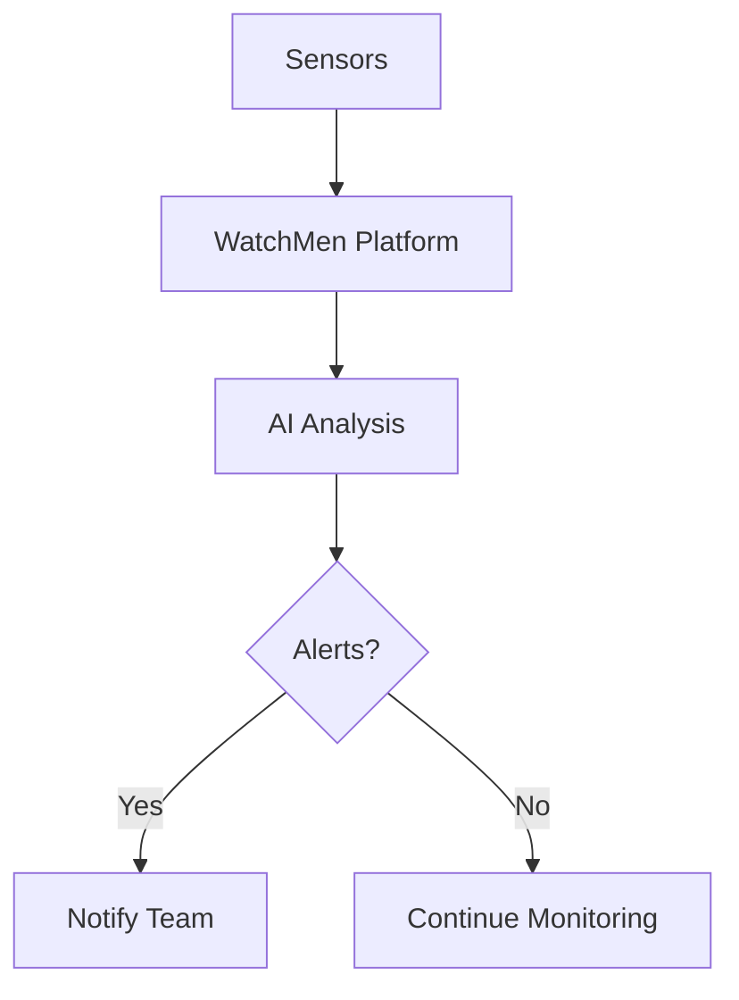

## Overview

Novo AI WatchMen Platform empowers you to monitor industrial machines in real-time, predict failures before they occur, and optimize operations using advanced AI. You gain actionable insights through intuitive dashboards, automated alerts, and customizable workflows. These core features help reduce downtime, lower maintenance costs, and boost productivity across manufacturing, energy, and logistics sectors.

<Callout kind="info">
WatchMen integrates seamlessly with IoT sensors and existing PLC systems. Start by connecting your devices via the dashboard at `https://dashboard.example.com`.
</Callout>

## Key Features

Discover the platform's standout capabilities through these feature cards.

<Columns cols={3}>
  <Card title="Real-time Monitoring" icon="activity" href="#real-time-monitoring">
    Track machine health metrics like vibration, temperature, and RPM instantly.
  </Card>
  <Card title="Predictive Maintenance" icon="trending-up" href="#predictive-maintenance">
    AI models forecast failures with 95% accuracy using historical data.
  </Card>
  <Card title="Data Analytics" icon="bar-chart-3" href="#data-analytics">
    Generate custom reports and visualize trends for better decisions.
  </Card>
  <Card title="Custom Workflows" icon="settings" href="#custom-workflows">
    Build tailored automation rules without coding expertise.
  </Card>
</Columns>

## Real-time Machine Monitoring

Set up continuous monitoring to receive instant alerts on anomalies.

<Steps>
  <Step title="Connect Devices" icon="link">
    Add your IoT sensors in the dashboard.

````javascript
// Example API call to register a device
const response = await fetch('https://api.example.com/v1/devices', {
  method: 'POST',
  headers: { 'Authorization': `Bearer ${YOUR_API_KEY}` },
  body: JSON.stringify({
    name: 'Machine-001',
    type: 'vibration-sensor',
    location: 'Factory-Line-A'
  })
});
````

  </Step>
  <Step title="Configure Alerts" icon="bell">
    Define thresholds for key metrics.
  </Step>
  <Step title="View Dashboard" icon="monitor">
    Access live data streams.
  </Step>
</Steps>

Alerts notify you via email, SMS, or webhooks when metrics exceed limits, such as temperature `{>80°C}`.

## Predictive Maintenance

Leverage AI models trained on your data to predict issues proactively.

<Tabs>
  <Tab title="Vibration Analysis" icon="activity">
    Detects imbalances early.

````python
import requests

payload = {
    "model": "vibration-predictor",
    "data": [120.5, 115.2, 130.1]  # Recent vibration readings
}
response = requests.post('https://api.example.com/v1/predict', json=payload)
print(response.json()['failure_probability'])  # e.g., 0.12
````
  </Tab>
  <Tab title="Temperature Forecasting" icon="thermometer-sun">
    Predicts overheating trends.

````javascript
// JavaScript example
const data = { readings: [75, 78, 82, 85] };
const prediction = await fetch('https://api.example.com/v1/predict/temperature', {
  method: 'POST',
  body: JSON.stringify(data)
});
````
  </Tab>
</Tabs>

<Callout kind="tip">
Schedule daily model retraining for optimal accuracy.
</Callout>

## Data Analytics and Reporting

Analyze performance with built-in tools.

| Metric          | Description                          | Threshold Example |
|-----------------|--------------------------------------|-------------------|
| Uptime         | Percentage of operational time       | `{>99%}`         |
| MTBF           | Mean time between failures           | `{>500 hours}`   |
| Energy Usage   | kWh per machine hour                 | `<10 kWh`        |

Export reports in PDF or CSV formats.

## Customizable Optimization Workflows

<Expandable title="Advanced Workflow Example" default-open="false">

Create rules like "If vibration `{>threshold}`, pause machine and notify team."

````yaml
# Workflow configuration
workflow:
  name: "High-Vibration Alert"
  trigger:
    metric: vibration
    operator: ">"
    value: 120
  actions:
    - type: "pause_machine"
    - type: "send_webhook"
      url: "https://your-webhook-url.com/webhook"
````

</Expandable>

## Industry Use Cases

<Columns cols={2}>
  <Card title="Manufacturing" icon="factory">
    Reduce downtime by 30% with vibration monitoring on assembly lines.
  </Card>
  <Card title="Energy Sector" icon="zap">
    Predict turbine failures using temperature and load data.
  </Card>
  <Card title="Logistics" icon="truck">
    Monitor fleet vehicles for predictive brake maintenance.
  </Card>
</Columns>



Ready to implement? Check the [Quickstart](/en/quickstart) for setup guidance.