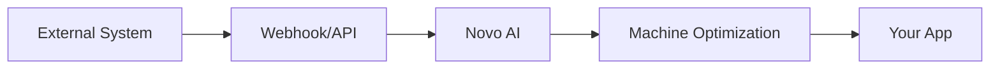

## Overview

Novo AI supports seamless integrations with external systems to streamline your machine optimization processes. Use the REST API for programmatic access, webhooks for real-time notifications, and pre-built connectors for popular tools. This enables automation across IoT sensors, ERP systems, and custom applications.

<Callout kind="info">
Before integrating, generate an API key from your dashboard at `https://dashboard.example.com/settings/api`.
</Callout>

## API Connections

Set up API connections to fetch machine data or trigger optimizations programmatically.

### Authentication

All API requests require a Bearer token. Use the `{API_KEY}` obtained from your dashboard.

<ParamField header="Authorization" param-type="string" required="true">
  Bearer `{YOUR_API_KEY}`
</ParamField>

<ParamField query="machine_id" param-type="string" required="false">
  Filter by specific machine ID.
</ParamField>

### Fetch Machine Status

Retrieve real-time status for your machines.

<Request tabs="JavaScript,cURL" show-lines="true">
  ```javascript
  const response = await fetch('https://api.example.com/v1/machines', {
    headers: {
      'Authorization': 'Bearer YOUR_API_KEY'
    }
  });
  const data = await response.json();
  console.log(data);
  ```
  ```bash
  curl -X GET 'https://api.example.com/v1/machines' \
    -H 'Authorization: Bearer YOUR_API_KEY'
  ```
</Request>

<Response tabs="200">
  ```json
  {
    "machines": [
      {
        "id": "mach_123",
        "status": "optimized",
        "performance": 98.5
      }
    ]
  }
  ```
</Response>

## Webhook Configuration

Webhooks notify your endpoint about events like machine alerts or optimization completions.

### Setup Steps

<Steps>
  <Step title="Create Webhook" icon="settings">
    Navigate to `https://dashboard.example.com/webhooks/new` and enter your endpoint URL, such as `https://your-webhook-url.com/novo-ai`.
  </Step>
  <Step title="Select Events" icon="zap">
    Choose events: `machine.optimized`, `alert.triggered`.
  </Step>
  <Step title="Verify Endpoint" icon="check-circle">
    Novo AI sends a challenge ping. Respond with `200 OK`.
  </Step>
</Steps>

### Handle Incoming Webhooks

Use this example to process payloads securely.

<CodeGroup tabs="Node.js,Python">
  ```javascript
  const express = require('express');
  const app = express();
  app.use(express.json());

  app.post('/novo-ai', (req, res) => {
    const event = req.headers['x-novo-event'];
    const payload = req.body;
    
    if (event === 'machine.optimized') {
      console.log('Machine optimized:', payload.machine_id);
    }
    
    res.status(200).send('OK');
  });

  app.listen(3000);
  ```
  ```python
  from flask import Flask, request, jsonify

  app = Flask(__name__)

  @app.route('/novo-ai', methods=['POST'])
  def webhook():
      event = request.headers.get('X-Novo-Event')
      payload = request.json
      
      if event == 'machine.optimized':
          print(f'Machine optimized: {payload["machine_id"]}')
      
      return jsonify({'status': 'OK'}), 200

  if __name__ == '__main__':
      app.run(port=3000)
  ```
</CodeGroup>

## Popular Integrations

Connect with common tools using APIs or Zapier/Make.com.

<Columns cols={3}>
  <Card title="ERP Systems" icon="database" href="https://dashboard.example.com/integrations/erp">
    Sync inventory and production data with SAP or Oracle.
  </Card>
  <Card title="IoT Devices" icon="zap" href="https://dashboard.example.com/integrations/iot">
    Pull sensor data from AWS IoT or Azure IoT Hub.
  </Card>
  <Card title="Monitoring Tools" icon="activity" href="https://dashboard.example.com/integrations/monitoring">
    Forward alerts to Datadog or New Relic.
  </Card>
</Columns>

## IoT and Sensor Integration

For IoT devices, use the Machines API to register sensors.

<Tabs>
  <Tab title="MQTT" icon="wifi">
    Publish sensor data to `mqtt.example.com/novo/sensors/{machine_id}`.
    
    ```bash
    mosquitto_pub -h mqtt.example.com -t novo/sensors/mach_123 \
      -m '{"temperature": 75.2, "vibration": 0.5}'
    ```
  </Tab>
  <Tab title="HTTP Push" icon="upload">
    POST directly to the ingestion endpoint.
    
    <Request show-lines="false">
      ```bash
      curl -X POST 'https://api.example.com/v1/sensors/ingest' \
        -H 'Authorization: Bearer YOUR_API_KEY' \
        -d '{"machine_id": "mach_123", "temperature": 75.2}'
      ```
    </Request>
  </Tab>
</Tabs>

## Best Practices

<Expandable title="Secure Integrations" default-open="true">
  - Rotate API keys monthly.
  - Use HTTPS for all endpoints.
  - Validate webhook signatures with HMAC SHA-256.
  - Limit webhook retries to 5 attempts.
</Expandable>

<Callout kind="tip">
  Monitor integration logs at `https://dashboard.example.com/logs` to debug issues quickly.
</Callout>



Integrate confidently to supercharge your workflows. For custom needs, contact support via the dashboard.